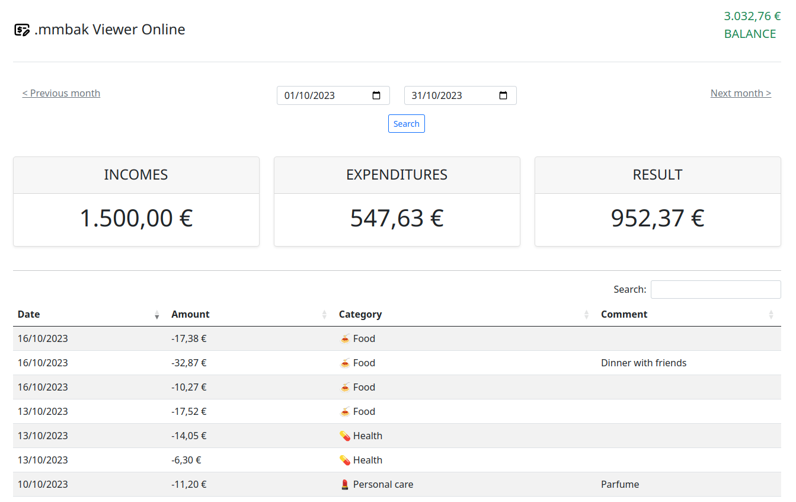

# .mmbak Viewer Online
Simple online viewer to navigate through the content of a mmbak file.

It uses the PHP library [mmbak viewer](https://github.com/ricci69/mmbak-viewer/), an open source project.

mmbak files are the backup of [Money Manager APP](https://realbyteapps.com/) (a wonderful personal finance app that I recommend you try).

&nbsp;
&nbsp;
## How to get started
After you have cloned this repository, just type these lines

### Install the required PHP libraries
```shell
composer update
```

### Install the required JS/CSS modules
```shell
npm update
```

### Copy your .mmbak inside the root directory
```shell
cp /somewhere/your_backup.mmbak /var/www/html/mmbak-viewer-online/db.mmbak
```

### Open your browser
[http://127.0.0.1/mmbak-viewer-online/](http://127.0.0.1/mmbak-viewer-online/)


&nbsp;
&nbsp;
## Contributions
Feel free to contribute to this project adding more feature or fixing issues.

&nbsp;
&nbsp;
## Support this / me
If you liked this work, and you haven't wasted hours of work with this repository, you can think about supporting me with Ko-fi

[](https://ko-fi.com/P5P5FY846)